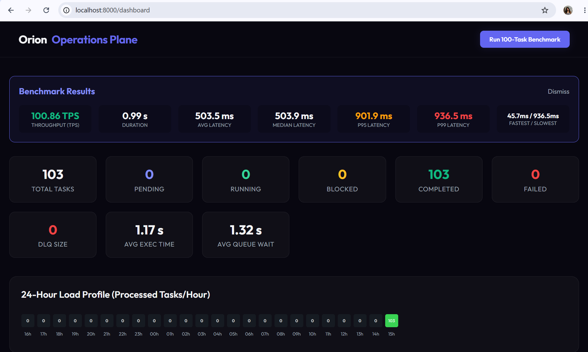
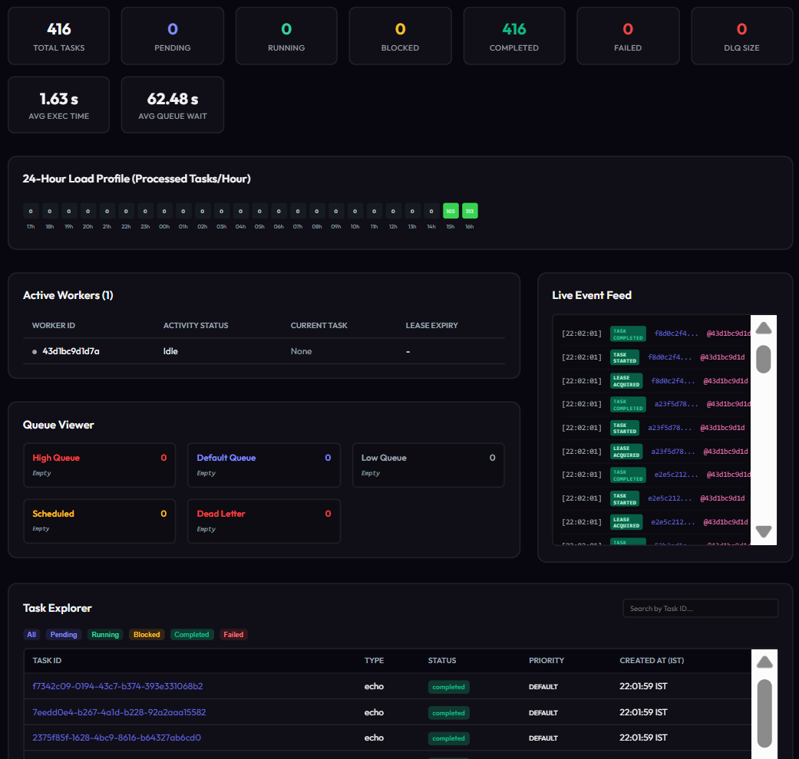
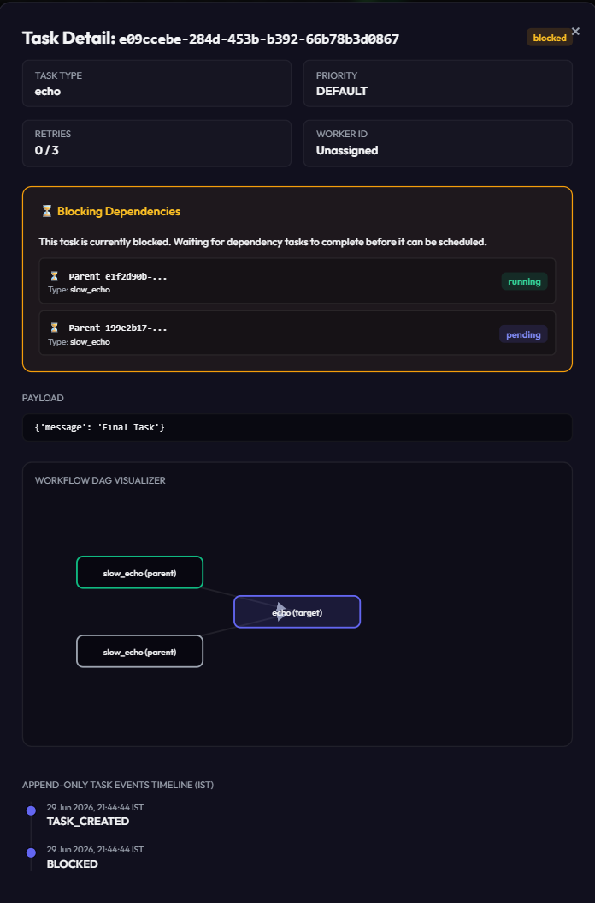
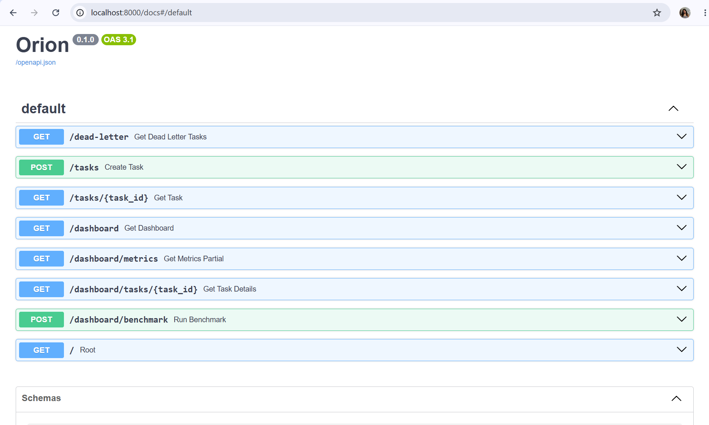
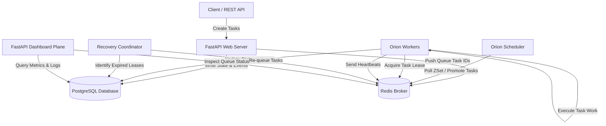

# Orion - Distributed Workflow & Task Orchestration Platform

Orion is a distributed task queue and workflow system built with Python, FastAPI, PostgreSQL, and Redis. It handles priority queues, scheduled tasks, task dependencies, worker recovery, retries, dead-letter queues, and includes a live dashboard.

---

## Why I Built This

I built Orion to learn how distributed workflow engines handle task scheduling, worker execution, retries, failure recovery, and monitoring.

Instead of treating background jobs like a simple queue, Orion tracks the full lifecycle of each task from creation and scheduling to execution, lease recovery, dependency resolution, and event logging.

---

## What It Does

- **Workflow Engine**: Run complex task flows with built-in dependency controls.
- **Priority & Scheduled Queues**: Set execution times and priority levels for tasks.
- **DAG Execution**: Child tasks wait until parent tasks finish successfully.
- **Worker Recovery**: Detect dead workers through heartbeats and reclaim their tasks.
- **Dead-Letter Queue & Retries**: Automatically retry failed tasks or send them to the DLQ.
- **Live Dashboard**: Monitor queue sizes, worker nodes, timelines, and events in real time.
- **Built-in Benchmarking**: Test throughput and latency directly from the UI.

---

## Demo

### Performance Benchmarking
The benchmark tool submits 100 concurrent tasks and shows throughput and latency stats in the dashboard.



---

### Operations Dashboard
Live dashboard showing queue health, worker activity, task metrics, event logs, and queue state.



---

### Workflow Dependencies
Blocked tasks show which parent tasks are preventing execution, along with their status and the workflow DAG.



---

### Interactive Swagger API
OpenAPI documentation for testing task creation, status queries, retries, and dashboard endpoints.



---

## How It's Built

Orion uses PostgreSQL as the main data store and Redis for execution.

- **PostgreSQL** stores task metadata, parent-child relationships, and execution events.
- **Redis** handles active queues, scheduled tasks, worker heartbeats, and active leases.
- **Workers** pull task IDs from Redis queues and update PostgreSQL during and after execution.
- **Dashboard** queries PostgreSQL for historical data and Redis for current queue and worker stats.

---

## Main Parts

| Component | What It Does |
| :--- | :--- |
| **API Server** | Accepts task requests and saves metadata. |
| **Scheduler** | Moves delayed tasks into ready queues. |
| **Worker** | Pulls tasks, runs the work, and reports progress. |
| **Recovery Coordinator** | Finds expired worker leases and re-queues abandoned tasks. |
| **Dashboard** | Shows live metrics and workflow state. |
| **PostgreSQL** | Main database for tasks and events. |
| **Redis** | Manages queues, schedules, heartbeats, and leases. |

---

## Features

### Queue Features
- **Priority Queues**: Tasks can use `high`, `default`, or `low` priority.
- **Scheduled Execution**: Set a task to run at a specific future time.
- **Worker Heartbeats**: Track active and idle worker nodes in real time.
- **Lease-Based Recovery**: Automatically re-queue tasks from dead workers.
- **Dead-Letter Queue (DLQ)**: Isolates tasks that have used up all retry attempts.
- **Automatic Retries**: Tasks retry on failure up to a configured limit.

### Workflow Features
- **Parent-Child Dependencies**: Tasks wait until all parent dependencies finish successfully.
- **Visualizer DAG**: Shows dependency graphs inside the dashboard.
- **Blocked Explanation**: Details which parent tasks are blocking execution or have failed.

### Observability Features
- **Live KPI Metrics**: Shows task counts, average execution time, and queue wait times.
- **Workers Monitor**: Displays worker status, heartbeat, current task, and lease expiry.
- **Queue Viewer**: Lists tasks in priority, scheduled, and dead-letter queues. Shows countdown timers for scheduled tasks.
- **24-Hour Heatmap**: Shows task load patterns by hour.
- **Event Log Feed**: Stream of task state changes.
- **Task Explorer**: Search and filter tasks by ID or status.

---

## Architecture

Orion has a FastAPI web server, Redis queues, a Scheduler daemon, Worker processes, and a Recovery Coordinator.



---

## Task Lifecycle

A task moves through these states:

```
[TASK CREATED] (API Server saves to PostgreSQL)
       |
       v
[TASK ENQUEUED] (API Server pushes task ID to Redis)
       |
       v
[LEASE ACQUIRED] (Worker pulls task ID and sets visibility lease)
       |
       v
 +-----+-----------------------+
 |                             v
 |                     [LEASE EXPIRED]
 |                             |
 |                             v
 |                      (Lease recovered;
 |                       re-enqueued or sent to DLQ)
 v
[TASK STARTED] (Worker runs the task)
 |
 +-------------------------+--------------------------+
 |                         |                          |
 v                         v                          v
[TASK COMPLETED]     [RETRY SCHEDULED]          [TASK FAILED] (DLQ PUSHED)
```

---

## Dashboard

- **KPI Cards**: Shows counts for task states. The Running card pulses when tasks are active.
- **Workers Monitor**: Shows worker status, heartbeat, current task, and lease expiry.
- **Queue Viewer**: Shows tasks waiting in Redis. Displays scheduled countdowns (e.g. `Runs in 27s`).
- **Live Event Feed**: Logs state updates like `LEASE ACQUIRED` and `TASK COMPLETED`.
- **Task Explorer**: Search box and filter buttons to find recent tasks.

---

## Benchmarking

The dashboard includes a benchmark that submits 100 concurrent tasks and measures performance.

Example results:

| Metric | Result |
| :--- | :--- |
| Throughput | 100.86 TPS |
| Duration | 0.99 s |
| Average Latency | 503.5 ms |
| Median Latency | 503.9 ms |
| P95 Latency | 901.9 ms |
| P99 Latency | 936.5 ms |
| Fastest Task | 45.7 ms |
| Slowest Task | 936.5 ms |

These come from actual task runs during a local Docker Compose deployment and show up directly in the dashboard.

---

## Tech Stack

| Component | Technology | What It Does |
| :--- | :--- | :--- |
| **Backend** | Python, FastAPI, Uvicorn | Async REST API. |
| **Database** | PostgreSQL, SQLAlchemy (asyncpg), Alembic | Stores tasks and events. |
| **Caching/Queueing** | Redis (redis-py async) | Queues, scheduled tasks, and heartbeats. |
| **Frontend** | Jinja2 Templates, Vanilla CSS, HTMX | Dashboard interface. |
| **Testing** | pytest, pytest-asyncio, HTTPX | Unit and concurrency tests. |
| **Infrastructure** | Docker, Docker Compose | Multi-container setup. |

---

## API Overview

Interactive API docs are at `/docs`.

| Method | Endpoint | Description |
| :--- | :--- | :--- |
| **GET** | `/` | Health check. |
| **POST** | `/tasks` | Create a task with priority, delay, retries, and dependencies. |
| **GET** | `/tasks/{task_id}` | Get task status, payload, results, and metadata. |
| **GET** | `/dead-letter` | List tasks in the Dead Letter Queue. |
| **GET** | `/dashboard` | Open the Operations Dashboard. |
| **GET** | `/dashboard/metrics` | Get live dashboard metrics. |
| **GET** | `/dashboard/tasks/{task_id}` | Get detailed task info, workflow DAG, and timeline. |
| **POST** | `/dashboard/benchmark` | Run the benchmark and get throughput and latency metrics. |

---

## Running Locally

### Start Services & Run Migrations
Build and start all containers, then run migrations:
```bash
git clone https://github.com/yourusername/Orion.git
cd Orion
docker compose up -d --build
docker compose exec api alembic upgrade head
```

### Stop Services
Shut down containers:
```bash
docker compose down
```

### Open Control Panels
- **Dashboard**: [http://localhost:8000/dashboard](http://localhost:8000/dashboard)
- **Swagger API**: [http://localhost:8000/docs](http://localhost:8000/docs)

---

## Project Structure

```
Orion
|
├── alembic/                  # Database migrations
├── docs/                     # Documentation
├── orion/
|   ├── models/               # SQLAlchemy models
|   ├── routes/               # API endpoints
|   ├── schemas/              # Pydantic schemas
|   ├── services/             # Business logic
|   ├── templates/            # Dashboard templates
|   |
|   ├── __init__.py
|   ├── config.py             # Config
|   ├── database.py           # Database session
|   ├── enums.py              # Task states
|   ├── events.py             # Task event logging
|   ├── exceptions.py         # Custom exceptions
|   ├── main.py               # App entry point
|   ├── queue.py              # Queue utilities
|   ├── recovery.py           # Lease recovery
|   ├── redis.py              # Redis client
|   ├── scheduler.py          # Scheduled task promotion
|   └── worker.py             # Worker implementation
|
├── tests/                    # Tests
|
├── .dockerignore
├── .gitignore
├── alembic.ini
├── docker-compose.yml
├── Dockerfile
└── pyproject.toml
```

---

## What I Learned

Building Orion taught me about:

- **Reliable Execution**: Designing async task execution states.
- **Lease Coordination**: Managing worker leases and heartbeats with Redis.
- **Fault Tolerance**: Recovering tasks from failed workers automatically.
- **DAG Scheduling**: Handling parent-child dependencies and workflow order.
- **Performance Profiling**: Measuring latency distributions and throughput.
- **Systems Observability**: Building dashboards that track metrics, workers, and queues.

---

## Future Work

- **Distributed Scheduler Lock**: Run multiple schedulers with distributed locks.
- **Real-time WebSockets**: Replace dashboard polling with WebSockets.
- **Autoscaling**: Scale workers based on queue length.
- **Metrics Integration**: Export stats to Prometheus.
- **Authentication**: Add JWT and API Key auth to task endpoints.