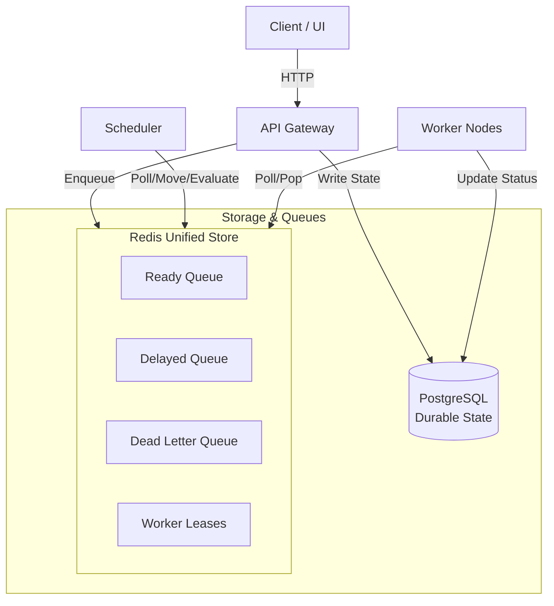
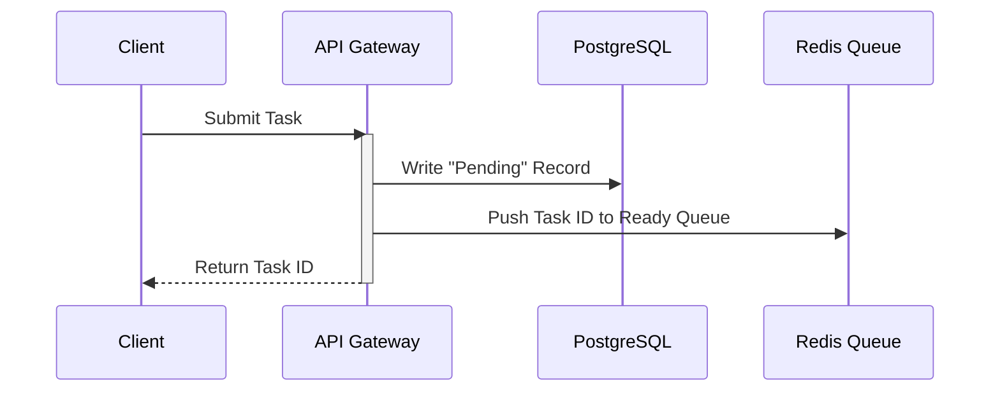
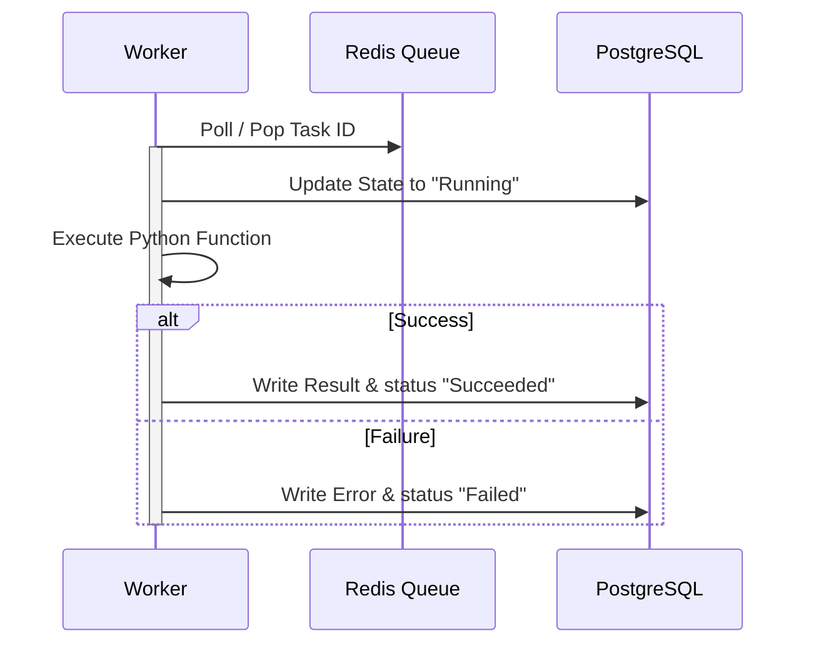

# Orion: Distributed Workflow and Task Orchestration Platform

This document is a collection of my thoughts, questions and plans. I have spent the last few weeks reading about Celery, RabbitMQ, Temporal and distributed queues. This is my attempt to organize what I have learned into a clear plan for my goal that is to build a distributed task queue and workflow engine from scratch.

## Orion

Orion is a system designed to run code asynchronously and orchestrate multi-step workflows. At its core, it will receive tasks from an API, queue them, distribute them to workers, and track their state. Eventually, I want it to coordinate complex workflows where tasks depend on other tasks (like a Directed Acyclic Graph, or DAG). This is not meant to replace Celery or Temporal in a production environment. Instead, it is a personal playground to learn how to build reliable distributed systems.

## Why am I building this?

I have built several backend projects using FastAPI, PostgreSQL, and Redis. In those projects, whenever I needed to send an email, process an image, or run a background job, I just installed Celery and ran a worker. It worked, but it always felt like a black box. I wrote `@app.task` and called `.delay()`, and somehow it worked. But if a worker died, or if Redis ran out of memory, I did not really know how to debug it without just restarting things.

I realized I was relying on complex tools without understanding the underlying principles. What happens when a message is acknowledged? How does Redis handle queue storage under the hood? How do you prevent two workers from picking up the exact same task at the exact same millisecond? 

This project is a way for me to move past just using existing tools. I want to become comfortable reasoning about distributed systems, handling network failures, managing state across processes, and dealing with concurrency. Building a task queue from scratch seems like the best way to force myself to confront these challenges.

## Guiding Principles

These are the rules I want to keep in mind when making design decisions:

* **Correctness over throughput**: It is better to process tasks slowly and safely than to lose them at high speeds.
* **Reliability over cleverness**: I want to choose simple, understandable algorithms over complex, highly optimized ones.
* **Simple architecture before distributed complexity**: Keep things centralized until distribution is absolutely required to solve a problem.

## Constraints

* I will assume worker processes can fail at any time without warning.

## Project Goal

My goal is not to write a library with as many features as Celery or Temporal. Instead, I want to build a minimal, highly correct system inspired by the systems I have been reading about:

* **RabbitMQ**: Specifically, how it handles message acknowledgements, channels, and reliable delivery.
* **AWS SQS**: The simplicity of its polling model and the concept of visibility timeouts.
* **Celery**: Its clean API for registering tasks and its worker execution model.
* **Temporal**: The concept of durable execution and tracking workflow state over time.
* **Airflow**: Representing tasks as dependency graphs (DAGs).

I want to focus on clean architecture and durability. I would rather have a queue that can only run simple Python functions but guarantees that a task is never silently lost than a feature-rich engine that loses tasks when a worker crashes. I will have to make trade-offs. For example, comparing worker assignment strategies highlights a classic distributed queue trade-off:

| Model | Pros | Cons | Current Choice |
| --- | --- | --- | --- |
| **Push** (Broker routes to workers) | Lower latency, tight control over load balancing | More complex broker, needs backpressure logic | |
| **Pull** (Workers poll broker) | Simpler broker, natural backpressure | Polling overhead, higher idle latency | ✅ Initial implementation |

## What I hope to learn

Instead of thinking of this as a set of features, I want to treat this project as a series of learning experiments:

* **Distributed systems**: I want to understand what partial failure actually feels like in code. What happens when the worker executes a task successfully but the database connection dies before the worker can write the result? How do we handle network partitions between the API gateway, the queue, and the workers?
* **Fault tolerance**: I want to design mechanisms for task retries, exponential backoff, dead-letter queues, and handling sudden worker crashes. If a worker gets killed by the OS (like an out-of-memory event), how does the system detect that the task is orphaned and reschedule it?
* **Worker coordination**: How do workers coordinate without a single point of failure causing race conditions? I want to see how distributed locking or state management prevents race conditions.
* **Scheduling**: Delaying tasks, cron-like schedules. How does a scheduler scale if there are thousands of scheduled tasks?
* **Queue design**: Difference between push and pull models. How do we prevent worker starvation or queue flooding?
* **Redis internals**: I want to understand how to use Redis for more than just basic caching. I want to learn how to use Sorted Sets for delayed tasks, Lists for ready queues, and Lua scripting to perform atomic operations (like checking out a task and updating its status in one step).
* **PostgreSQL**: I want to learn how to use database transactions and locking mechanisms to maintain a durable audit log of tasks. I want to experiment with row locking to see if a relational database can act as a reliable queue broker.
* **Observability**: I want to learn how to trace a request as it hops across different services. If a user submits a workflow, I want to see the trace flow from the API to the scheduler, into the queue, and finally to the specific worker that executes it.
* **System design**: I want to practice separating concerns. The API should not care how the worker executes the task; the worker should not care how the task was scheduled. I want to design clean interfaces between these components.
* **Concurrency**: I want to understand Python's concurrency models better. Should the worker use multiprocessing, multithreading, or asyncio to run tasks? How do we manage shared state and avoid race conditions within a single worker process?
* **Production backend architecture**: I want to learn how to structure a multi-container application using Docker and orchestrate it so that it is easy to run and test locally.

## How I'm Thinking About the System

Right now, I am imagining Orion as three independent concerns:

* Accepting work,
* Deciding when work should run,
* And executing work.

Everything else, such as retries, workflows, metrics, and dashboards, exists to support those three responsibilities. I am hoping that keeping this mental model in mind will help me avoid coupling unrelated parts of the system as it grows.

## High-Level Architecture

I have been drawing diagrams to figure out how these pieces should fit together. This is my current plan for the system components.



### API Gateway
The API Gateway is the entrypoint. It does not run any heavy tasks. Its job is to validate incoming tasks, write a record to the PostgreSQL database so we have a durable record of the task's existence, and push the task metadata into the Redis queue. By keeping the API Gateway lightweight, it should be able to accept tasks quickly and return a `task_id` to the user almost instantly.

### Scheduler
At the moment, I am grouping these responsibilities into one Scheduler because it keeps the architecture simple:
* Moving delayed tasks to the ready queue when they are due.
* Triggering recurring cron tasks.
* Coordinating workflow DAGs.

I suspect I will eventually split them into separate components as the project grows, but for now, a single process will manage scheduling.

### Redis
I plan to represent Redis as a single unified store containing several structures: the ready queue, the delayed queue, the dead-letter queue, and active worker leases. I think PostgreSQL should probably become the source of truth, while Redis acts as the transient execution layer. This separation feels cleaner, although I still need to think through recovery scenarios if Redis loses state.

### PostgreSQL
PostgreSQL is the database for durable state. One question I still have is whether PostgreSQL should merely be an audit log or whether it should become the authoritative state machine for workflows. I am leaning towards using it as the authoritative record, which will make state recovery easier if Redis crashes.

### Worker Dispatcher (Deferred)
I am debating whether I will eventually need a standalone Dispatcher component. A Dispatcher could act as a coordinator that knows the capacity of each worker and pushes work to them. However, a simpler design is to have workers poll Redis directly. I have left the Dispatcher out of the initial architecture diagram because I want to start with direct worker polling, but I might introduce it in a later stage if I need advanced routing or capability-based matching.

### Workers
Workers are the processes that do the actual computation. They poll the queue, pull down a task, execute the Python function associated with it, and update the state in PostgreSQL. I want to run them in separate Docker containers so I can scale them up or down easily.

### Dashboard
The dashboard exists purely as an operational window into the system. The backend is the focus of this project, so I want to avoid spending too much time here.

### Monitoring
I plan to run Prometheus to scrape metrics from the API Gateway, Scheduler, and Workers, and use Grafana to build a dashboard showing queue latency and throughput.

---

### Request Flow: Enqueueing a Task

To visualize how a task moves through the system, I drew this sequence:



Once the task is in the Ready Queue, a worker will pick it up:



---

## What happens if...

### A worker dies after popping a task?
```
The task disappears from Redis.
↓
How does another worker know it existed?
↓
This is exactly the problem leases and visibility timeouts solve.
```
I am thinking of using a Sorted Set in Redis to store worker leases. When a worker pops a task, it writes a lease with an expiration time. If the worker does not renew the lease, the Scheduler will reclaim the task and put it back in the Ready Queue.

### The scheduler crashes while transferring delayed tasks to the ready queue?
```
A delayed task might be moved to the ready queue but not recorded, or it might get processed twice.
↓
How do we ensure it is moved exactly once?
↓
This is where Redis transaction blocks or Lua scripting are needed to ensure the read and write operations are atomic.
```
I am considering writing a Lua script that pops the task from the delayed sorted set and pushes it to the ready list atomically, preventing other processes from grabbing it mid-transition.

## Why these technologies?

I chose this stack because it represents a balance between technologies I already know and systems I want to understand deeper.

* **Python**: It is the language I am most comfortable with. Using Python means I can write the core logic quickly. The trade-off is execution speed, which is limited by the Global Interpreter Lock (GIL). However, for an I/O-bound coordinator and worker system, Python should be fine. If I need speed later, I could write workers in Go or Rust, but Python is the best starting point.
* **FastAPI**: It is lightweight, supports async/await natively, and generates API docs automatically. I considered Flask, but FastAPI's async support makes it much easier to write high-concurrency API endpoints that write to Redis without blocking the event loop.
* **Redis**: It is extremely fast and provides data structures that map perfectly to queues. I'm leaning towards Redis Sorted Sets because they seem like a natural fit for delayed scheduling, although I want to compare this with keeping delayed tasks in PostgreSQL. I also considered RabbitMQ, but I want to understand how to build queue primitives myself. Using Redis forces me to implement my own acknowledgment and retry logic.
* **PostgreSQL**: I need a relational database to handle structured workflow definitions. I also want to explore using PostgreSQL as a backup queue using row locking.
* **SQLAlchemy**: It is the standard Python ORM. It adds some overhead, but it will save me from writing raw SQL. I'll need to be careful with session management in async contexts to avoid locking up database connections.
* **Docker**: This is essential. I want to run multiple worker containers, a Redis container, a Postgres container, and the API gateway. Docker will let me simulate a distributed environment on my local laptop.
* **Prometheus and Grafana**: I want to get used to production-grade monitoring. I could write a custom script to print queue sizes, but learning Prometheus will teach me how to export clean metrics and build useful dashboards.
* **OpenTelemetry**: Distributed tracing is something I have only read about. I want to see how a trace header can be passed through Redis to a worker, allowing me to view a single timeline of a task's life across different processes.
* **Dashboard Frontend**: I am debating whether to build a simple React single-page app or use something lighter like Jinja2 templates with HTMX. HTMX feels like a better fit because it keeps the focus on backend system internals rather than UI state management.

## System Evolution

I plan to build it in stages, letting each stage solve the problems of the previous one.

### Stage 1: Reliable Distributed Queue
The first stage is just getting a single task from a client to a worker reliably. The system will start as a single API instance, a single Redis queue, and one worker process. The goal is to successfully run a basic task and record its output in PostgreSQL.

### Stage 2: Production Queue
After building the first prototype, I expect the first weakness to appear when workers fail unexpectedly. Recovering from those failures naturally leads to retries, dead-letter queues, and leases. Once those exist, supporting multiple queues and different scheduling policies becomes much easier.

### Stage 3: Workflow Engine
As the system matures, simple independent tasks will become limiting. I will want to run tasks in a specific sequence or run them in parallel and aggregate their results. This will lead to implementing workflow orchestration using DAGs. I will need to design a state machine that evaluates task dependencies and checkpoints workflow state in PostgreSQL so we can resume failed workflows without starting over.

### Stage 4: Observability
With workflows running across multiple workers, finding bugs will get difficult. I will need to add distributed tracing via OpenTelemetry to track tasks as they move across processes, and collect performance metrics to understand queue latencies.

### Stage 5: Advanced Distributed Systems Concepts
Once the core engine is stable, I want to explore ideas that make the system more robust under load. I am considering implementing leader election using Redis locks to allow running multiple schedulers, adding idempotency keys to handle duplicate API submissions, and experimenting with the transactional outbox pattern to make database and queue writes atomic.

I fully expect many of the decisions in this document to change once I begin building. That's probably a good sign. The goal isn't to predict the final architecture perfectly. It's to have a starting point, build something real, discover what's wrong with my assumptions, and iterate from there.
